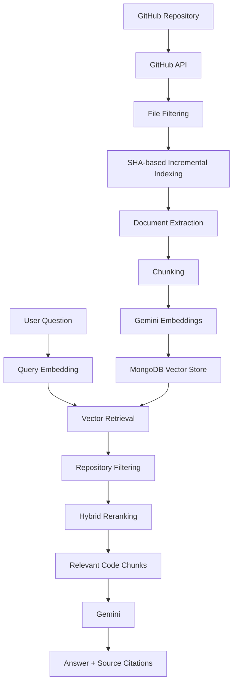

# GitHub Codebase RAG

An AI-powered codebase assistant that allows developers to analyze a GitHub repository and ask natural-language questions about its code.

The system fetches repository files from GitHub, extracts and chunks source code, generates embeddings, stores them in MongoDB's vector database, retrieves relevant code using semantic and lexical signals, reranks the results, and uses Gemini to generate an answer with source citations.

---

## Overview

Understanding an unfamiliar codebase can be time-consuming.

This project provides a repository-aware AI assistant that lets a developer:

1. Enter a GitHub repository URL.
2. Analyze and index the repository.
3. Ask questions about the codebase.
4. Retrieve relevant code chunks.
5. Generate an AI-powered explanation.
6. See the files and line ranges used as sources.

### Example Questions

```text
How does the recommendation system work?

Which files handle authentication?

Where is the database connection configured?

How does the API process user requests?

What files are responsible for the recommendation logic?
```

---

## Features

- GitHub repository ingestion
- Supported-file filtering
- SHA-based incremental indexing
- Document extraction
- Code chunking with overlap
- Gemini embeddings
- MongoDB vector storage
- Repository-aware retrieval
- Semantic similarity search
- Lexical matching
- File-path relevance scoring
- Hybrid reranking
- Gemini-powered RAG responses
- Source file and line citations
- Incremental re-indexing of changed files
- Removal of stale chunks from deleted/changed files
- Repository isolation during retrieval
- Chat-based codebase exploration
- API validation and error handling
- Docker-based MongoDB setup

---

## Architecture



---

## How It Works

### 1. Repository Ingestion

The user provides a GitHub repository URL.

The backend:

- Parses the repository URL.
- Fetches repository information using GitHub.
- Retrieves the repository file tree.
- Identifies supported files.

---

### 2. Incremental SHA-Based Indexing

The system compares the SHA of files currently present on GitHub with the SHA values stored in MongoDB.

This allows the system to avoid reprocessing unchanged files.

The indexing process identifies:

```text
New files
Changed files
Unchanged files
Deleted files
```

Only new or changed files are processed and embedded.

When files are changed or removed, stale chunks are deleted.

This makes repeated repository indexing significantly more efficient than rebuilding the entire index every time.

---

### 3. Document Extraction

Supported repository files are downloaded and converted into documents containing:

- Source code
- File path
- Repository
- Branch
- Language
- File extension
- File SHA
- Line information
- Chunk metadata

---

### 4. Chunking

Large source files are divided into smaller chunks before embedding.

The project currently uses:

```text
Chunk size: 100 lines
Overlap: 20 lines
```

The overlap helps preserve context between neighboring chunks.

Each chunk receives a version-aware identifier based on:

```text
repository
file path
file SHA
chunk index
```

---

### 5. Embeddings

Each code chunk is converted into a vector embedding using:

```text
Gemini Embeddings
Model: gemini-embedding-2
Dimensions: 3072
```

These embeddings allow semantically related code to be retrieved even when the user's wording does not exactly match the source code.

---

### 6. Vector Storage

Embeddings and their metadata are stored in MongoDB.

The MongoDB collection contains information such as:

```text
repository
filePath
language
extension
sha
chunkIndex
startLine
endLine
embedding
```

MongoDB provides the vector search index used during retrieval.

---

### 7. Retrieval and Repository Isolation

When a user asks a question, the query is converted into an embedding.

Relevant vector candidates are retrieved from the shared MongoDB vector index.

Repository isolation is then enforced using repository metadata.

The retrieval system uses a fallback path for environments where native repository filtering in the vector search stage does not return candidates.

The effective flow is:

```text
User Query
    |
    v
Query Embedding
    |
    v
Vector Candidate Retrieval
    |
    v
Repository Filtering
    |
    v
Hybrid Reranking
    |
    v
Top Relevant Chunks
```

This prevents results from unrelated repositories from being returned to the user.

---

### 8. Hybrid Reranking

Vector similarity alone is not used as the final ranking signal.

Retrieved chunks are reranked using multiple signals:

```text
Semantic similarity     60%
Lexical relevance       20%
File-path relevance     20%
File-type adjustment
```

This helps prioritize code that is both semantically relevant and likely to be useful for the user's specific question.

---

### 9. RAG Generation

The highest-ranked code chunks are provided to Gemini as context.

Gemini then generates an answer based on the retrieved repository content.

The response contains:

```text
Answer
+
Source files
+
Line ranges
+
Retrieval relevance scores
```

This gives the user both an explanation and the repository locations used to produce it.

---

## Tech Stack

### Frontend

- Next.js 16
- React 19
- Tailwind CSS
- React Markdown
- Remark GFM
- Lucide React

### Backend

- Node.js
- Express
- Octokit
- MongoDB Node.js Driver
- Google Generative AI SDK
- dotenv
- CORS

### AI / RAG

- Gemini
- Gemini Embeddings
- Vector similarity search
- Hybrid retrieval
- Reranking
- Retrieval-Augmented Generation (RAG)

### Infrastructure

- MongoDB Atlas Local
- Docker
- Docker Compose

---

## Project Structure

```text
GitHub Codebase/
|
+-- backend/
|   +-- src/
|   |   +-- config/
|   |   |   +-- mongodb.js
|   |   |
|   |   +-- controllers/
|   |   |   +-- repositoryController.js
|   |   |   +-- searchController.js
|   |   |
|   |   +-- repositories/
|   |   |   +-- chunkRepository.js
|   |   |
|   |   +-- routes/
|   |   |   +-- repositoryRoutes.js
|   |   |   +-- searchRoutes.js
|   |   |
|   |   +-- services/
|   |   |   +-- chunkEmbeddingService.js
|   |   |   +-- chunkService.js
|   |   |   +-- documentService.js
|   |   |   +-- embeddingService.js
|   |   |   +-- geminiService.js
|   |   |   +-- gitHubServices.js
|   |   |   +-- queryEmbeddingService.js
|   |   |   +-- vectorSearchService.js
|   |   |
|   |   +-- utils/
|   |   |   +-- contentDecoder.js
|   |   |   +-- fileFilter.js
|   |   |   +-- gitHubParser.js
|   |   |   +-- languageDetector.js
|   |   |
|   |   +-- server.js
|   |
|   +-- .env.example
|   +-- package.json
|
+-- frontend/
|   +-- src/
|   |   +-- app/
|   |   |   +-- globals.css
|   |   |   +-- layout.js
|   |   |   +-- page.js
|   |   |
|   |   +-- components/
|   |       +-- chatBot.js
|   |       +-- repoInput.js
|   |
|   +-- package.json
|
+-- docker-compose.yml
+-- package.json
+-- package-lock.json
+-- .gitignore
+-- README.md
```

---

## API Endpoints

### Health Check

```http
GET /
```

Response:

```json
{
  "success": true,
  "message": "GitHub Codebase backend is running"
}
```

---

### Index Repository

```http
POST /api/repository/index
```

Request:

```json
{
  "repoUrl": "https://github.com/AyushRanjan29/MovieMate"
}
```

The endpoint:

- Fetches repository metadata
- Reads the GitHub file tree
- Detects changed files
- Extracts source documents
- Creates chunks
- Generates embeddings
- Stores new chunks
- Removes stale chunks

---

### Search Codebase

```http
POST /api/search
```

Request:

```json
{
  "query": "How does the recommendation system work?",
  "repository": "AyushRanjan29/MovieMate"
}
```

Response:

```json
{
  "success": true,
  "query": "How does the recommendation system work?",
  "answer": "Gemini generated answer...",
  "sources": [
    {
      "filePath": "main.py",
      "startLine": 1,
      "endLine": 87,
      "score": 0.859
    }
  ]
}
```

---

## Environment Variables

Create:

```text
backend/.env
```

Example:

```env
PORT=5000
MONGODB_URI=mongodb://localhost:27017
GITHUB_TOKEN=your_github_token_here
GEMINI_API_KEY=your_gemini_api_key_here
FRONTEND_URL=http://localhost:3000
```

Do not commit `.env` to Git.

The repository contains `.env.example` as a template.

---

## Setup

### 1. Clone the Repository

```bash
git clone <your-repository-url>
cd "GitHub Codebase"
```

---

### 2. Start MongoDB

The project uses MongoDB Atlas Local through Docker Compose.

Run from the project root:

```bash
docker compose up -d
```

The MongoDB container is configured as:

```text
Container: github-rag-mongodb
Port: 27017
```

Check running containers:

```bash
docker ps
```

---

### 3. Configure Backend

Move into the backend directory:

```bash
cd backend
```

Install dependencies:

```bash
npm install
```

Create:

```text
backend/.env
```

and add:

```env
PORT=5000
MONGODB_URI=mongodb://localhost:27017
GITHUB_TOKEN=your_github_token_here
GEMINI_API_KEY=your_gemini_api_key_here
FRONTEND_URL=http://localhost:3000
```

---

### 4. Start Backend

Development:

```bash
npm run dev
```

Production-style start:

```bash
npm start
```

Backend:

```text
http://localhost:5000
```

---

### 5. Start Frontend

Open another terminal.

From the project root:

```bash
cd frontend
```

Install dependencies:

```bash
npm install
```

Start the development server:

```bash
npm run dev
```

Frontend:

```text
http://localhost:3000
```

---

## Running the Project

Once both services are running:

```text
Frontend
http://localhost:3000
        |
        v
Next.js Chatbot
        |
        v
Express Backend
http://localhost:5000
        |
        v
MongoDB Vector Search
        +
        |
        v
Gemini
        |
        v
Answer + Sources
```

### Typical Workflow

1. Open the frontend.
2. Enter a GitHub repository URL.
3. Click **Analyze**.
4. Wait for indexing to complete.
5. Ask a question about the repository.
6. The backend retrieves relevant code.
7. Gemini generates the answer.
8. Source files and line ranges are displayed below the response.

---

## Example

Repository:

```text
https://github.com/AyushRanjan29/MovieMate
```

Question:

```text
What files are responsible for the recommendation logic?
```

The system retrieves relevant repository chunks and generates an explanation while displaying the corresponding source files and line ranges.

---

## Repository-Aware Retrieval

The system supports multiple repositories in the same MongoDB collection.

For example:

```text
AyushRanjan29/SageScan
AyushRanjan29/MovieMate
```

When a repository is selected, its full name is passed with the user's query:

```json
{
  "query": "How does the recommendation system work?",
  "repository": "AyushRanjan29/MovieMate"
}
```

The retrieval layer uses this repository metadata to isolate results.

This allows multiple repositories to share the same vector store while preventing unrelated repository chunks from being used for an answer.

---

## Incremental Indexing

The indexing pipeline is designed to avoid unnecessary work.

If a repository is analyzed again without changes:

```text
Unchanged files
    |
    v
No extraction
    |
    v
No chunking
    |
    v
No embedding
    |
    v
No new database inserts
```

If a file changes:

```text
Changed SHA
    |
    v
Re-extract file
    |
    v
Re-chunk
    |
    v
Re-embed
    |
    v
Store new chunks
    |
    v
Delete stale chunks
```

If a file is deleted from GitHub:

```text
File missing from current tree
        |
        v
Delete its stored chunks
```

---

## Error Handling

The backend validates incoming requests before processing them.

Examples include:

- Missing search query
- Invalid search query type
- Missing repository
- Invalid repository URL
- Unknown API routes
- Repository indexing failures
- Search failures

API errors return structured JSON responses instead of exposing internal error details to clients.

---

## Docker MongoDB

MongoDB is configured through:

```text
docker-compose.yml
```

The service uses:

```text
mongodb/mongodb-atlas-local:latest
```

and persists database data through a Docker volume.

### Start MongoDB

```bash
docker compose up -d
```

### Stop MongoDB

```bash
docker compose down
```

---

## Current Limitations

- The application currently runs locally.
- MongoDB is configured through Docker for local development.
- Gemini and GitHub API access require valid credentials.
- The current UI is designed primarily for development/demo use.
- The vector retrieval fallback is retained for compatibility with the current MongoDB Atlas Local environment.
- Authentication and multi-user access control are not currently implemented.

---

## Future Improvements

Possible future improvements include:

- User authentication
- Repository history and saved projects
- Streaming Gemini responses
- Improved code-aware chunking
- AST-based code understanding
- Function/class-level retrieval
- Better source-code visualization
- GitHub webhook-based automatic re-indexing
- Background indexing jobs
- Redis caching
- Production MongoDB deployment
- Deployment of frontend and backend
- Usage monitoring and analytics
- Improved test coverage

---

## Development Scripts

### Backend

```bash
npm run dev
npm start
```

### Frontend

```bash
npm run dev
npm run build
npm start
npm run lint
```

---

## License

This project is currently intended as an educational and portfolio project.

Add a specific license here if the repository is later released under an open-source license.